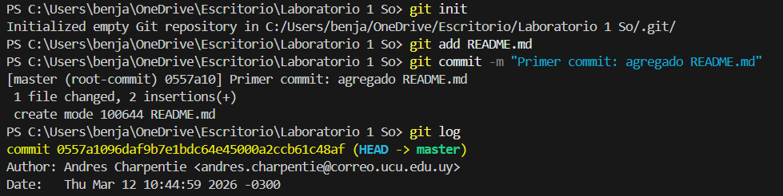
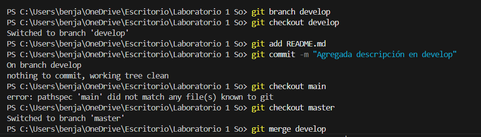

# Post-Laboratorio 1: Introducción a Git y GitHub

## 1. Introducción

Git es un sistema que permite registrar los cambios realizados en archivos a lo largo del tiempo, facilitando el trabajo en equipo y el seguimiento del desarrollo de proyectos. Por otro lado, GitHub es una plataforma en la nube que permite almacenar repositorios Git de forma remota, compartirlos y colaborar con otros usuarios.

El objetivo de este laboratorio fue aprender los conceptos básicos de Git y GitHub, así como utilizar los comandos esenciales para gestionar un repositorio local y conectarlo con un repositorio remoto.

## 2. Desarrollo

### Inicialización del repositorio

Primero se creó una carpeta en la computadora para el laboratorio y se abrió una terminal en dicha ubicación. Luego se ejecutó el comando:

```
git init
```

Este comando inicializó un repositorio Git local, permitiendo comenzar a registrar cambios en los archivos del proyecto.

### Creación y seguimiento de archivos

Se creó un archivo llamado README.md con una breve descripción del laboratorio. Luego se utilizaron los siguientes comandos:

```
git add README.md
git commit -m "Primer commit: agregado README.md"
```

`git add` agrega el archivo al área de preparación (staging area).

`git commit` guarda los cambios de forma permanente en el historial del repositorio.

### Visualización del historial

Para verificar los cambios realizados se utilizó:

```
git log
```

Este comando permite visualizar todos los commits realizados, incluyendo el autor, fecha y mensaje asociado.

### Trabajo con ramas (branches)

Se creó una nueva rama llamada develop para trabajar de forma separada del código principal:

```
git branch develop
git checkout develop
```

Luego se realizaron modificaciones en el archivo README.md y se guardaron:

```
git add README.md
git commit -m "Agregada descripción en develop"
```

Posteriormente se volvió a la rama principal:

```
git checkout main
```

Y se fusionaron los cambios:

```
git merge develop
```

Esto permitió integrar los cambios realizados en la rama secundaria al proyecto principal.

### Conexión con repositorio remoto

Se creó un repositorio en GitHub y se vinculó con el repositorio local mediante:

```
git remote add origin <URL_del_repositorio>
```

Finalmente, se subieron los cambios al repositorio remoto:

```
git push -u origin main
```

Este paso permitió almacenar el proyecto en la nube y compartirlo.

## 3. Conclusiones

Durante este laboratorio se aprendieron los conceptos fundamentales de Git y GitHub, incluyendo la creación de repositorios, el manejo de commits y el uso de ramas para organizar el trabajo.

Uno de los aprendizajes más importantes fue entender cómo funciona el flujo de trabajo de Git: modificar archivos, agregarlos al staging area y luego confirmarlos con un commit. También se comprendió la importancia de las ramas para trabajar de manera ordenada sin afectar el código principal.

Entre las dificultades encontradas, se destacó la comprensión inicial de algunos comandos y el manejo de branches. Sin embargo, estas dificultades se resolvieron mediante la práctica y la repetición de los pasos.

En conclusión, Git es una herramienta fundamental en el desarrollo de software, ya que permite llevar un control eficiente de los cambios y facilita el trabajo colaborativo.

## 3. Imagenes del Laboratorio



